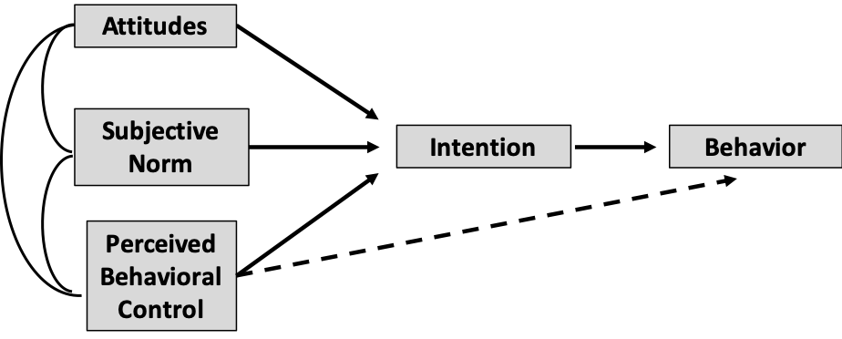
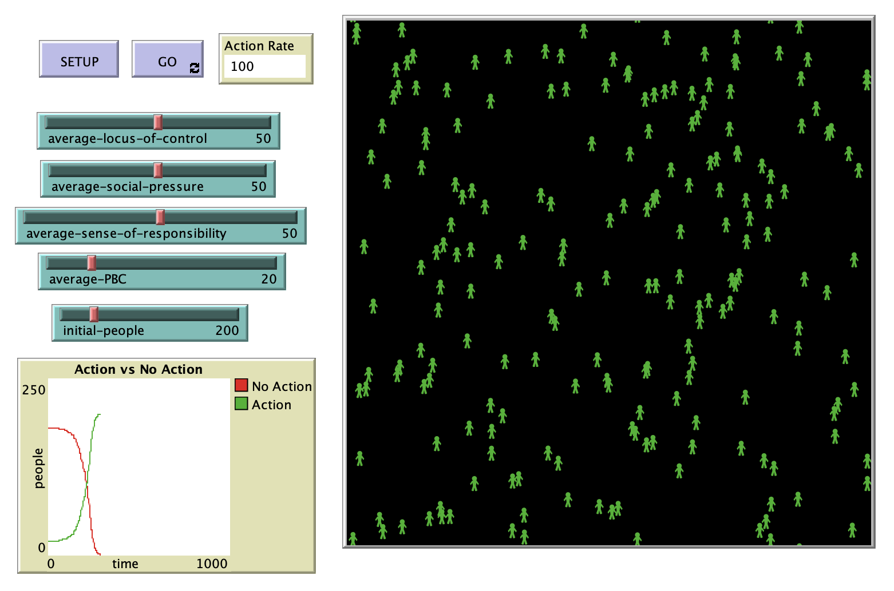

# Its Not Easy Being Green: A modeling approach to analyzing environmentally friendly behavior

## Abstract

"Climate change is one of the most serious and challenging problems facing our world today. While in the past, tackling the problem of climate change has been the responsibility of environmental groups and national policy makers, today it is widely believed that individual actions are at the root of the problem and every person must engage in pro environmental behavior. Unfortunately, the increase in environmental knowledge and concern has not translated to a sufficient increase in individual pro environmental behavior. This study attempts to analyze the gap between values such as environmental concern and environmentally friendly behavior. The authors developed the Green Behavior Model, an Agent Based Model, to examine emergent collective behavior resulting from individual factors based on the Theory of Planned Behavior and Cultural Theory."

**Reference**:

**Ajzen, I. (1985)**. From intentions to actions: A theory of planned behavior.  In *Action control* (pp. 11-39). Springer, Berlin, Heidelberg.

## &nbsp;
"Simplified diagram of Ajzen’s theory of planned behavior. The dashed line implies that *perceived behavioral control* (PBC), if correctly perceived, can be actual behavioral control and thus contribute directly to behavior:"

Model Logic Flow:

The NetLogo Graphical User Interface of the Model: 

## &nbsp;

**Version of NetLogo**: NetLogo 6.1.0

**Semester Created**: Fall 2015

