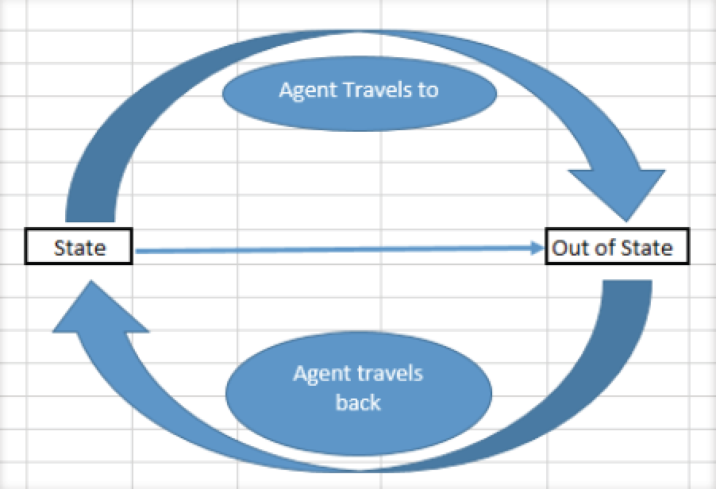
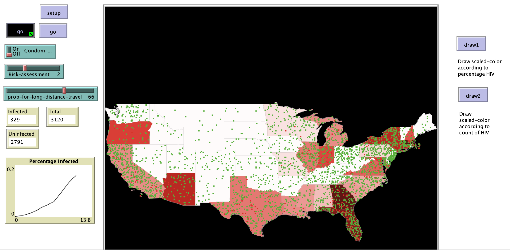

# An Agent-Based Modeling Approach Applied To The Diffusion Of HIV In States With High Travel

## Abstract

"Since AIDS was first discovered, mathematical, computational, and other empirical models of the transmission dynamics of HIV have been developed to determine the drivers of the epidemic. While several prevention methods have been developed since its discovery, there is still a constant need to educate health policy reforms that would help aid the prevention of the spread of HIV as there are always concerns the optimal combination of biomedical, behavioral and social interventions and structures that have an impact on HIV policies.This model takes into account a combination of not just health policies but also one other non-health policy related factor, interstate travel,to model the spread of HIV across state borders. This model ingefforthighlightsthepotentialof agent-based modeling to explore the diffusion of choleraina travel-­state boundaries context."

## &nbsp;
Movement of the Agents in the Model:

The NetLogo Graphical User Interface of the Model: 

## &nbsp;

**Version of NetLogo**: NetLogo 6.1.0.

**Semester Created**: Fall 2015.

