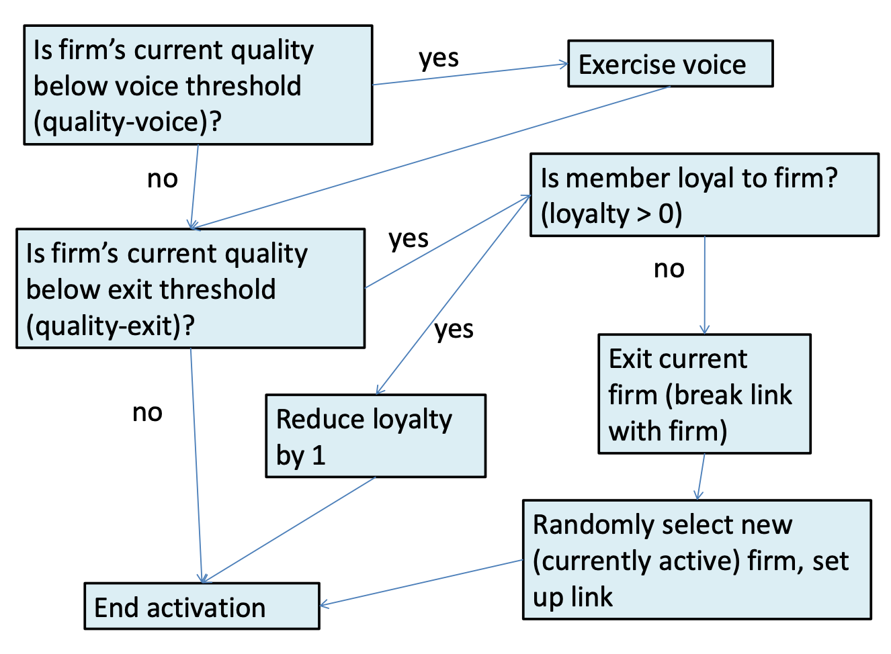
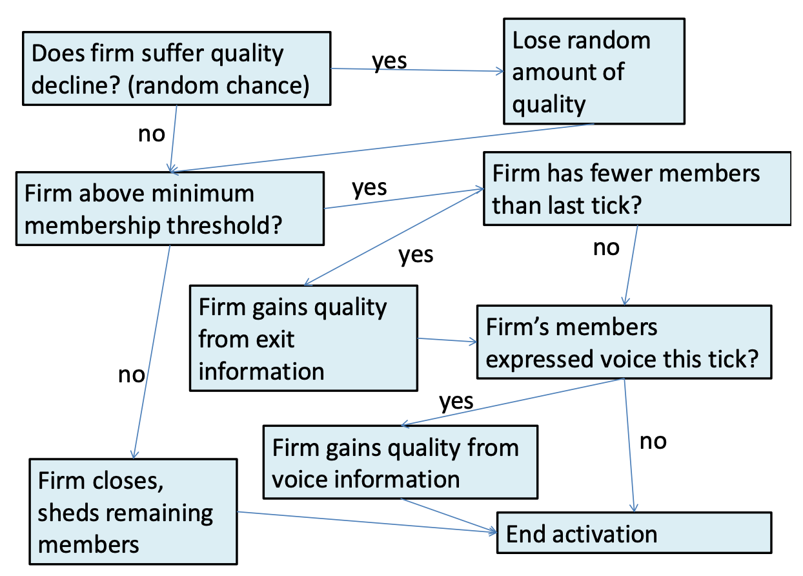
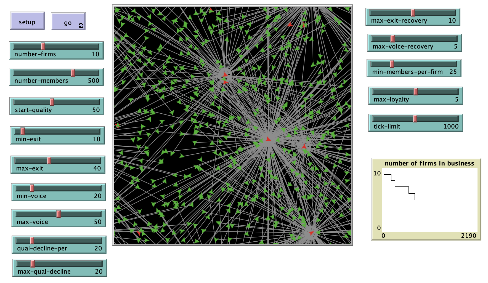

# Hirschman’s Exit, Voice, and Loyalty: An Agent-Based Model Implementation

## Model Description 

"Economist Albert Hirschman’s theory of exit, voice, and loyalty discusses the different ways that customers of a firm or members of an organization respond to a decrease in quality of the goods provided by the firm or organization. The theory seeks, in part, to understand how firms or organizations can recover from lapses in quality, based on the mix of responses from the customer/member base.  Customers/members can Exit by shifting consumption to another firm or another good or another organization, or they can Voice their concerns in an effort change the firm/organization’s behavior.  Because of the distinctly non-equilibrium, non-perfect competition implications of this theory, utilizing an agent-based model to study it seems appropriate." 

**Referecne**:
Hirschman, Albert.  *Exit, Voice, and Loyalty: Responses to Decline in Firms, Organizations, and States*.  1970.  Harvard University Press: Cambridge.

## &nbsp;
"Flow diagram for member in a given tick (note that each member is asked to do all of this in a given tick, but not all at the same time)":

"Flow diagram for firm in a given tick (note that each firm is asked to do all of this in a given tick, but not all at the same time)":

The NetLogo Graphical User Interface of the Model: 

## &nbsp;

**Version of NetLogo**: NetLogo 6.1.0

**Semester Created**: Fall 2012

