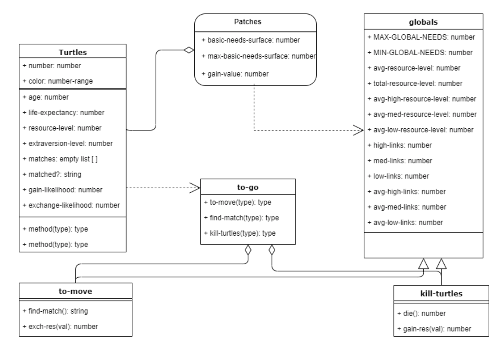
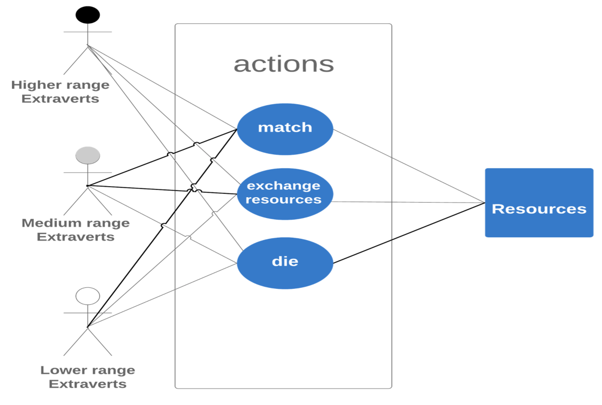
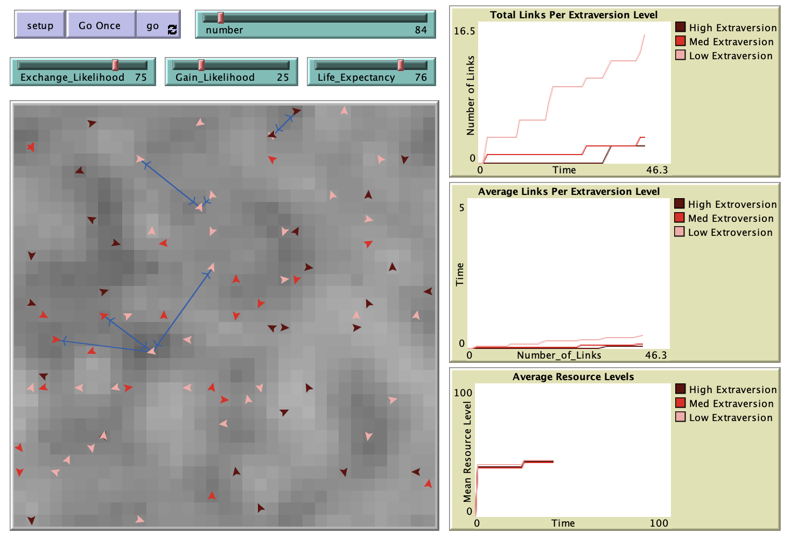

# Multiagent Modeling of Extraversion Reveals Dynamics of Reward Processing

## Abstract
"Inter- and intra-individual variability, such as personality traits, remains a challenge in psychological research. Depue and Collins (1999) [D&C] theorized dopaminergic signaling in humans gives rise to variations in personality traits such as extraversion. Although neurobiological perspectives on personality traits have been appreciated by psychologists, predicting the results of interactions between personality traits such as extraversion in computational modeling remains poorly studied. Moreover, recent studies suggest modeling the D&C theory may be implausible, although those assertions have never been directly tested. Linking influential theories of personality to computational models and their simulations could yield insight into understanding human social behavior. Agents were artificially generated within NetLogo to simulate learning & pursuit of rewards. A one-way ANOVA test revealed non-significant differences between each level of extraversion (low, medium, and high) and the average number of links acquired by each agent type. Agent-based modeling can be a useful tool in developing empirical theories underlying the biology of personality."

## Reference
**Depue RA, Collins PF.** Neurobiology of the structure of personality: dopamine, facilitation of incentive motivation, and extraversion. *Behav Brain Sci.* 1999 Jun;22(3):491-517; 

## &nbsp;
"A UML diagram of classes, their attributes, and the relationships between each other":

"A state transition diagram of model logic and interactions between different agents and the environment during the course of the simulation":

"A use case actor diagram of actions and interactions between different agents and the environment (the resources) during the course of the simulation":

The NetLogo Graphical User Interface of the Model: 

## &nbsp;

**Version of NetLogo**: NetLogo 6.1.0

**Semester Created**: Fall 2019.

