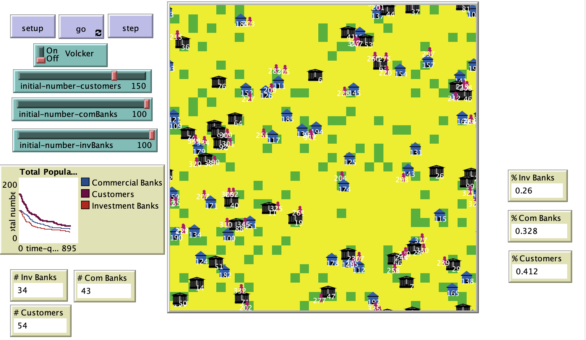

# Would the Volcker Rule Limit Banks’ Ability to Compete?

## Abstract 

This model explores the effects the Volcker Rule may have on investment banks’ ability to attract customers and, therefore, stay in business if risk is reduced by restricting proprietary trading or investment in hedge funds.  For purposes of this agent-based model, investment banks are defined as taking deposits and participating in proprietary trading or investing in hedge funds.  Would the Volcker Rule cause the banks to lose market share and eventually go out of business?  The agent-based model will reveal some trends related to the duration of transition stages that may evolve and the final effects of retaining customers if the Volcker Rule were implemented.
This agent-based model is simple and only tests the assertion that the Volcker Rule will affect the viability of investment banks.  The agent-based model will use three agents – customers, investment banks and commercial banks (taking deposits only) – that will be assigned a randomly generated risk factor at the beginning of each tick.  Each tick represents a quarter of a year.  Customers and commercial banks have the same risk factor range of 1 to -1.  Investment banks have a risk factor range of 2 to -2.  Customers and commercial banks begin with a $5 balance; and the investment bank begins with a $6 balance. The customer will choose the bank with a risk factor that is equal to or less than her own risk factor and deposit $1.  At the end of each tick, the profit is split 50/50 between the bank and the customer.  When the banks’ or customers’ balance is $1 or less, then the bank fails and the customer becomes unbanked."
  

**Keywords**:  Volcker Rule, Dodd-Frank Consumer Protection and Wall Street Reform Act, 2008 financial crisis, too-big-to-fail institutions, banks, banking reform, proprietary trading, hedge funds, private equity funds  

## &nbsp;
The NetLogo Graphical User Interface of the Model: 

## &nbsp;

**Version of NetLogo**: NetLogo 6.1.0

**Semester Created**: Fall 2012

