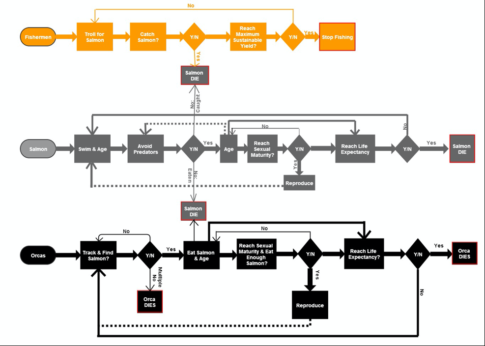

# The role of fisheries in direct and indirect species declines: The case of the Chinook salmon fishery in the Pacific Northwest

## Abstract 

"Chinook salmon (*Oncorhynchus tshawytscha*) in the Pacific Northwest (North America) is harvested in commercial, recreational and subsistence fisheries. Management of the stocks that are commercially harvested depends on previous catch estimates and estimates of the current season’s catch, often poorly calculated based on old data. Multiple environmental stressors in the species’ range is affecting the ability of Chinook salmon stocks to rebound with commercial fishing pressure. In the marine environment, resident orcas (Orcinus orca) feed primarily on adult Chinook salmon. Pollution and depletion of prey resources are considered the chief causes of reduction in orca populations and the status of orcas in the Pacific Northwest as regionally endangered. An ecological individual-based model of the interactions between Chinook salmon, resident orcas and commercial fishermen in the Pacific Northwest could allow for a new method of analyzing changes in variables affecting both marine species. The model developed for the Chinook salmon fishery tested the effects of fishing pressure, environmental stressors and conservation measures on the population dynamics of both marine species. The abstraction provided by the model simulations generated patterns that elucidated the behavior of Chinook salmon, resident orcas and commercial fishermen in the Pacific Northwest. The emergent properties of the model suggesedt that even under modest fishing pressure, low stocks of salmon cannot sustain orca populations. Additionally, even when environmental and conservation efforts increased the life expectancy and population size of orcas, the fishing pressure is preventing the population from growing. This highlights the importance of adaptive management of this fishery and the importance of including orcas in the fishery management equations."

## &nbsp;
"Flow chart representing the activities of each agent—resident orcas, Chinook salmon and commercial fishermen—for simulations run in the Chinook salmon fishery model". 

The NetLogo Graphical User Interface of the Model: 

## &nbsp;

**Version of NetLogo**: NetLogo 6.1.0

**Semester Created**: Fall 2013

