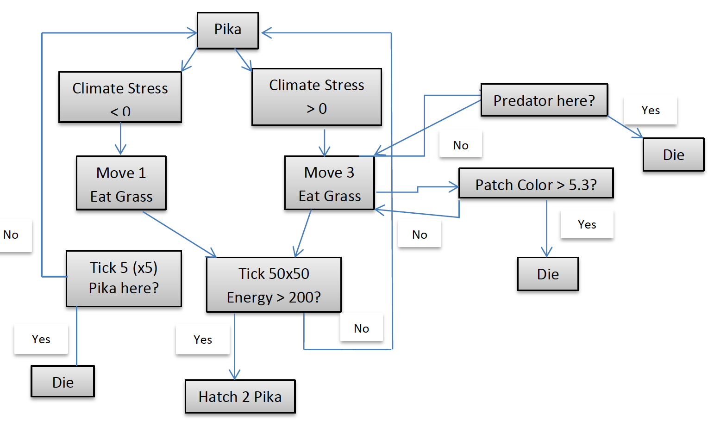
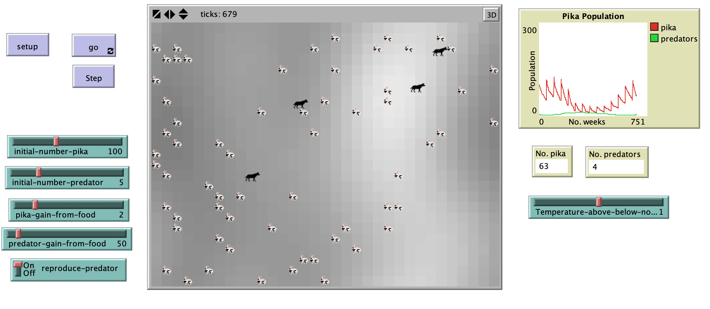

#  Modeling The American Pika Habitat In The Light Of Climate Change

## Abstract
"The American pika (Ochotona princeps) is a lagomorph that lives in alpine regions across the USA. Research has established that it is particularly sensitive to climate change. An attempt was made to have the pika listed as endangered species since its alpine habitat it shrinking due to climate change. The listing failed. We designed an agent-based model to demonstrate how pika populations are affected by the predator-prey relationship and also by patch dependency. Our findings suggest that under climate stress, pika populations decline according to the amount of viable habitat. In our model, the predator-prey relationship becomes less important than patch availability as a population control mechanism as predators use more energy to search for pikas that have retreated to higher ground."
## &nbsp;
Flow diagram of model logic for Pikas:

Flow diagram of model logic for preditors:

The NetLogo Graphical User Interface of the Model: 

## &nbsp;

**Version of NetLogo**: NetLogo 6.1.0

**Semester Created**: Fall 2012

