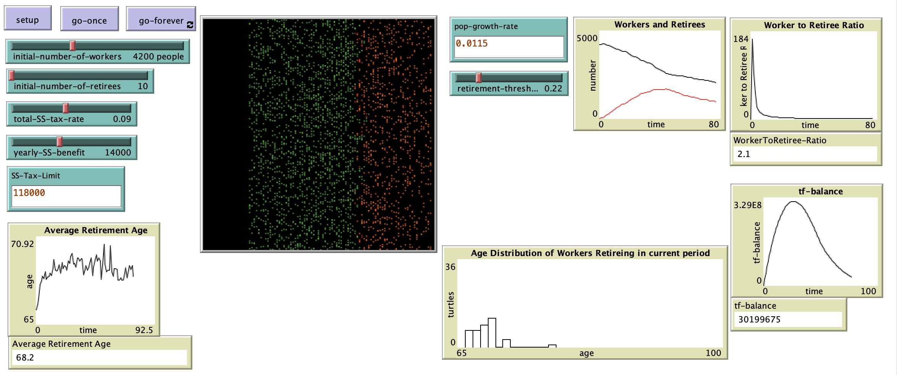

# An Agent Based Model for Understanding the Dynamics of the Social Security Trust Fund

## Abstract
Society has to make decisions about how they will provide for their elderly and retired members. Historically economic security in old age was achieved though close family ties. If more recent times this individual model of social security has given way to a collective model in which entire working cohorts collectively support retirees. This paper will describe an agent based model designed to help understand the dynamics of Social Security and the Social Security Trust Fund. Examples will focus on Social Security as it is set up in the United States. In order to model the retirement decision I have elected to use an implementation of the Axtell/Epstein Retirement model.

**Keywords**: Agent Based Model, Retirement, Social Security

**Reference**:
Axtell, R., & Epstein, J. (1999). Coordination in Transient Social Networks: An Agent-Based Computational Model of the Timing of Retirement. Center on Social and Economic Dynamics Working Paper, No. 1.

## &nbsp;
The NetLogo Graphical User Interface of the Model: 

## &nbsp;

**Version of NetLogo**: NetLogo 6.1.0

**Semester Created**: Fall 2014

