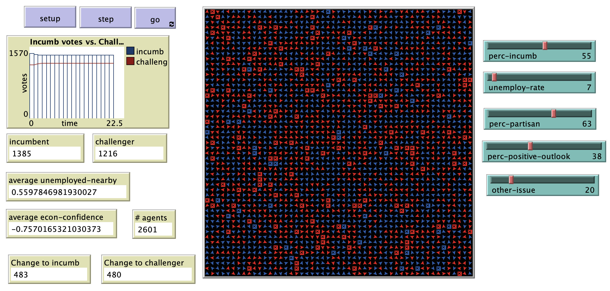

# Voters' Economic Confidence Levels, Partisanship and Support for Incumbents: An Agent-Based Model Analyzing the 2012 US Presidential Elections

# Abstract: 
"In the US Presidential Elections in 2012, incumbent President Barack Obama defeated Republican challenger Mitt Romney, winning all swing states.  According to national polling, 59% of voters believed the economy was the most important issue facing the country.  Only 15% of Americans believed the economy was good or excellent with an unemployment rate at 8.1%.  Despite these dismal statistics, 40% of Americans nationwide believed the economy was improving. Within this paper, we develop an agent-based model that examines the factors affecting US voters, which include: partisanship to a political party, perception of current economy, and outlook on the economy.  We model the voting behavior of a simulated population within a two-party electoral system—incumbent versus challenger parties."

## &nbsp;
Fast and Frugal Diagram of the Model:

The NetLogo Graphical User Interface of the Model: 

## &nbsp;

**Version of NetLogo**: NetLogo 6.1.0

**Semester Created**: Fall 2015

