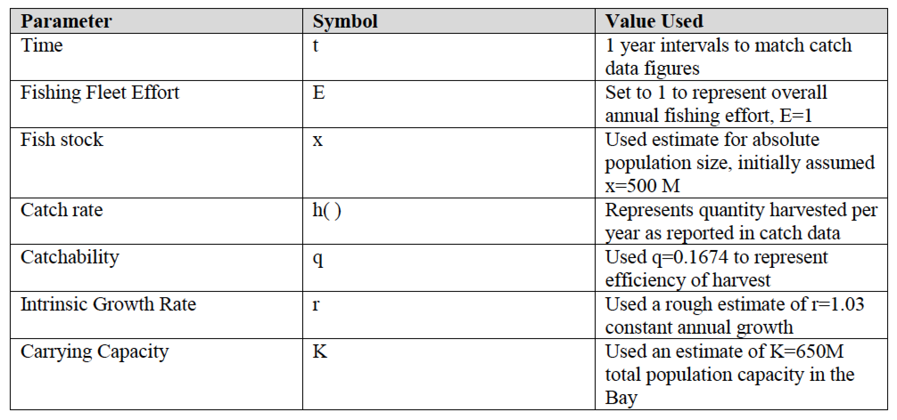
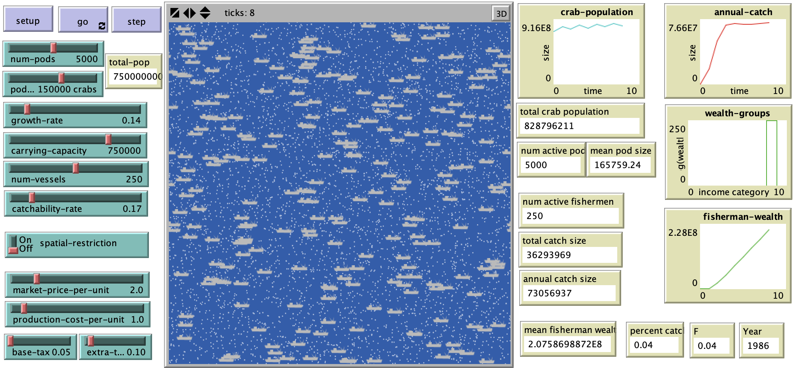

# Modeling Sustainable Crab Harvest in the Chesapeake Bay

## Abstract

"The Blue Crab (*Callinectes sapidus*) is an important commercial and recreational fishing resource for the Chesapeake Bay. Due to a variety of factors, including declining water quality, loss of breeding habitats, and increased fishing pressure, the harvest of Blue Crabs has been declining in recent years. This study uses modeling techniques to assess the effects of two types of policies that can be applied to regulate crab fishing in the Chesapeake Bay area. One type of policy is spatially-based, and involves partitioning the bay into distinct parcels in which fishing is allowed for some parcels but banned for other parcels for a period of years. This allows the crab population to recover over a period of time. The second type of policy is to allow unrestricted fishing throughout the bay, but to impose a catch-tax that provides a financial penalty for fishermen who overharvest. This policy does not have a spatial component, but uses a social policy component instead. The study uses a classical sustainable fisheries mathematical model as a basis for rough-order of magnitude calculations and initial validation metrics. The study uses an abstract spatially explicit model of the Chesapeake Bay, in which crab populations and fishermen are modeled as agents, and the bay is modeled as the landscape. The model is used to assess the impacts of fish harvesting policies on the crab population dynamics and harvest rates."

## &nbsp;
Model parameters:

Parameters Used for Schaefer Model:

UML Class Diagram for Model:

Model Execution Flow:

The NetLogo Graphical User Interface of the Model: 

## &nbsp;

**Version of NetLogo**: NetLogo 6.1.0

**Semester Created**: Spring 2010