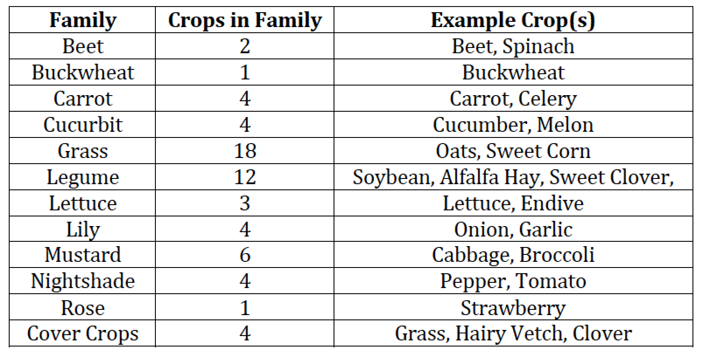
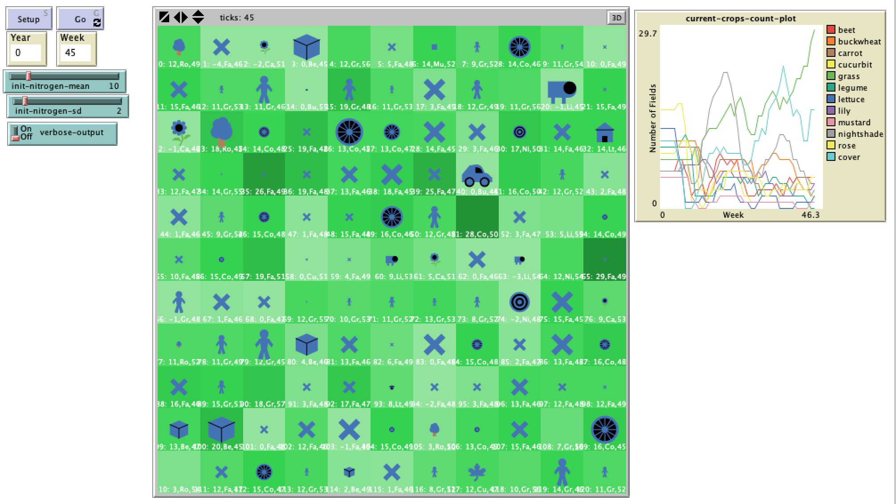

# Modeling Crop Rotation Strategies on Organic Farms in the Northeast United States 

## Abstract
Crop selection on a farm is one of the farmer’s most important responsibilities. This task can be complicated even further on organic farms where the addition of synthetic fertilizers is prohibited. This simulation uses an agent-­based modeling approach to investigate crop selections and crop rotations on an organic farm in the Northeast United States. The analysis focuses on crop selections and the rules used to make the crop selections due to variations in soil nitrogen levels. Analysis shows that both crop selection aswell as the rules for selection are dependent on soil nitrogen levels.

**Keywords**: Crop Rotation, Organic Farming, Agent-BasedModeling, Farm Simulation.

## Major Referece on Which the Model is Based On:

**Mohler, C. L. and Johnson, S.E. (2009)**, C*rop Rotation on Organic Farms: A Planning Manual*, Natural Resource, Agriculture, and Engineering Service, Ithaca, NY. Link: <https://www.sare.org/Learning-Center/Books/Crop-Rotation-on-Organic-Farms>

## &nbsp;

Crop Families:

Crop Nitrogen Requirements and Classification:

Model Parameters:

The NetLogo Graphical User Interface of the Model: 

## &nbsp;

**Version of NetLogo**: Orignal Model NetLogo 4.1. Updated to NetLogo 6.1.0.

**Semester Created**: Spring 2010
