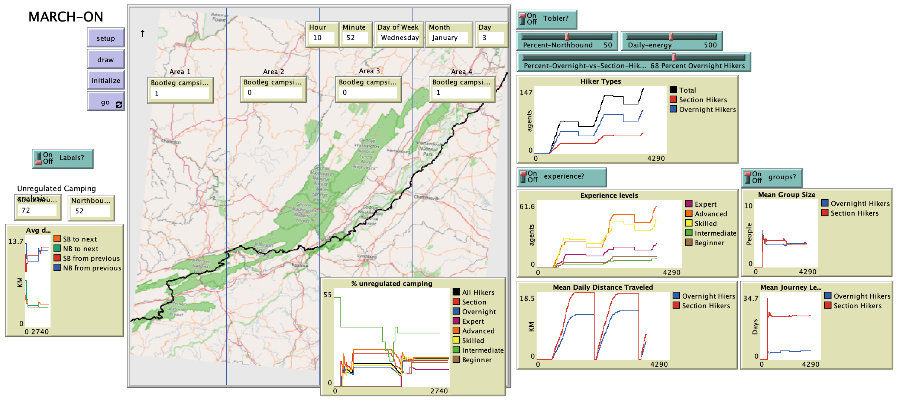

# Modeling Appalachian Trail Recreation: Camping, Hiking & Overcrowding in our Natural parks (MARCH-ON)

## Abstract

"The Appalachian Trail (AT) is America’s most famous hiking trail, but increasing visitor numbers put pressure on campsites and threatens the AT’s ecosystem and character. AT hikers are strongly encouraged to use designated campsites to minimize their impact on the environment, but hikers frequently engage in “unregulated” camping where no designated campsite is available. Within this paper we introduce MARCH-ON, an agent-based model which simulates AT hiker movement and the camping decision-making process to identify the areas of the AT in Virginia most at-risk for cumulative environmental damage caused by unregulated camping. MARCH-ON seeks to combine accurate GIS data, AT hiker survey data, Tobler’s hiking function, and agent-based modeling concepts to model the dynamics of hiker behavior and the spatial relationships of campsite locations along the AT. MARCH-ON demonstrates that hikers tend to camp in unregulated “bootleg” campsites when the distance between designated campsites is large, and that inexperienced hikers are most likely to engage in unregulated camping. Findings indicate that the northeastern portion of the AT in Virginia, including Shenandoah National Park, is most at-risk for damage from unregulated camping."

## &nbsp;

Agent and Environment Parameters:

Hiking Flowchart:

The NetLogo Graphical User Interface of the Model: 

## &nbsp;

**Version of NetLogo**: NetLogo 6.1.0.

**Semester Created**: Spring 2016.
