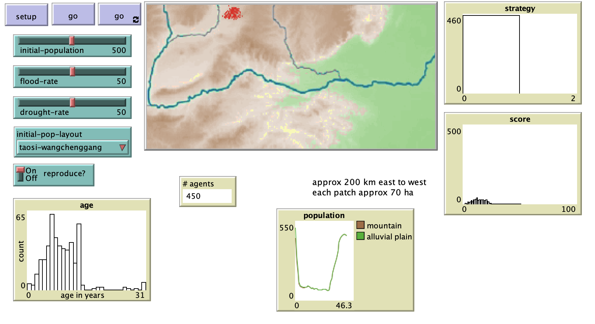

# Using Agent Based Modeling to Replicate Origins of Social Complexity: The Case of Limited Evidence in the Late Longshan Cultures and Early Erlitou Culture

## Abstract

"Within the archaeological record for Bronze Age Chinese culture, there continues to be a gap in our understanding of the sudden rise of the Erlitou State from the previous late Longshan chiefdoms. In order to examine this period, I develop and use an agent based model (ABM) to explore possible socio-politically relevant hypotheses for the gap between the demise of the late Longshan cultures and rise of the first state level society in East Asia. I test land use strategy making and collective action in response to drought and flooding scenarios, the two plausible environmental hazards at that time. The model results show cases of emergent behavior where an increase in social complexity could have been experienced if a catastrophic event occurred while the population was sufficiently prepared for a different catastrophe, suggesting a plausible lead for future research into determining the life of the time period."

## &nbsp;
Activation Schedule:

The Canonical Theory of Social Complexity – Fast Process (Cioffi-Revilla 2014)

The NetLogo Graphical User Interface of the Model: 

## &nbsp;

**Version of NetLogo**: NetLogo 6.1.0.

**Semester Created**: Spring 2016.

